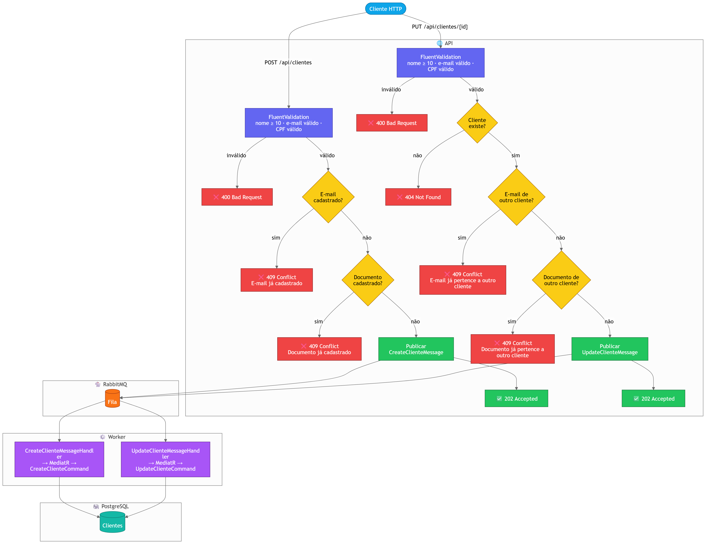

# Rebus.Clientes 🚀

Aplicação modelo em `.NET 8` para demonstrar CRUD de clientes com **Clean Architecture**, **CQRS**, **EF Core + PostgreSQL** e processamento assíncrono com **Rebus + RabbitMQ**.

## 🎯 Objetivo

Este projeto foi planejado para ser uma referência prática de:

- **APIs com contratos consistentes** — mesmo formato de resposta, mensagens claras e códigos HTTP previsíveis, para o cliente (humano ou sistema) não adivinhar o formato em cada endpoint;
- **validação robusta com FluentValidation** — regras de entrada declaradas e testáveis, separadas dos controladores e reutilizáveis entre camadas;
- **escrita assíncrona com mensageria** — operações que não precisam concluir antes da resposta HTTP devolvem `202` e o trabalho pesado segue em um processo separado;
- **integração de Rebus com RabbitMQ** — o último item refere-se ao **Rebus**: uma biblioteca .NET de mensagens que usa o **RabbitMQ** como transporte neste repositório (cenário próximo do que se usa em produção: fila, worker, falhas e logs).

## 🧱 Arquitetura da solução

| Projeto                         | Tipo           | Responsabilidade                                                                 |
| ------------------------------- | -------------- | -------------------------------------------------------------------------------- |
| `Rebus.Clientes.Api`            | WebApi         | Entrada HTTP, validação de borda, publicação de mensagens, middleware de exceção |
| `Rebus.Clientes.Application`    | ClassLibrary   | Casos de uso CQRS, DTOs, validators, contratos de persistência                   |
| `Rebus.Clientes.Domain`         | ClassLibrary   | Entidades e exceções de domínio                                                  |
| `Rebus.Clientes.Infrastructure` | ClassLibrary   | EF Core, repositórios, Fluent API, migrations                                    |
| `Rebus.Clientes.Worker`         | Worker Service | Consumo Rebus e persistência assíncrona                                          |

Solução: `Rebus.Clientes.slnx`.

## 📦 Sobre o Rebus (a “framework” de mensagens)

O **Rebus** não é um framework de UI nem substitui o ASP.NET Core: é uma **biblioteca de service bus** para .NET — ou seja, ajuda a publicar e consumir **mensagens** com uma API estável, enquanto o **RabbitMQ** (neste repositório) é o **broker**: o serviço que guarda e entrega mensagens na rede.

- **O que o Rebus acrescenta em relação ao cliente AMQP “cru”**: convenções de registro com DI (`AddRebus`), handlers tipados (`IHandleMessages<T>`), transporte plugável e um modelo mental de “enviar comando / tratar evento” sem gerenciar manualmente cada detalhe de canal e fila.
- **Quando escolher Rebus (ou algo equivalente)**: equipes .NET que já usam **RabbitMQ** (ou outro transporte suportado), precisam de **workers** em processos separados, e querem código de domínio nos handlers em vez de laços de consumo AMQP genéricos.
- **Quando _não_ for a primeira opção**: protótipo mínimo sem broker; equipe sem capacidade de operar filas; ou requisito de plataforma gerenciada (nesse caso costuma-se avaliar **Azure Service Bus**, **Amazon SQS**, etc., embora o Rebus também possa integrar-se com vários transportes — consulte a documentação oficial).
- **Alternativas na mesma “prateleira”**: **MassTransit**, **NServiceBus** (comercial), ou cliente **RabbitMQ.Client** direto — trade-off típico entre convenção/abstração (Rebus/MassTransit) e controle fino (cliente de baixo nível).

Neste repositório, o RabbitMQ aparece nas connection strings e no Docker Compose; o Rebus é **a cola** entre a Web API que **publica** e o Worker que **consome**. Para o detalhe desse desenho dentro desta solução, veja a seção **Rebus neste repositório: papel, fluxo e código** (mais abaixo neste README).

## 🚌 Rebus em foco: quando usar e onde isso aparece neste projeto

A seção anterior descreve **o que é** o Rebus e o papel do broker; abaixo focamos em **quando** adotar esse padrão e **em quais pastas** deste repositório o código costuma ficar.

O **Rebus** resolve o problema de **ligar processos**: a API recebe o pedido HTTP, **enfileira um comando** e o **Worker** (outro processo) **consome** a mensagem e persiste com a mesma lógica de aplicação (MediatR). Sem isso, ou tudo roda na mesma instância da API (mais simples, mas acoplado e mais frágil sob carga), ou é preciso escrever manualmente consumo AMQP, reconexões e formato de mensagens.

### Quando faz sentido usar Rebus (como aqui)

- **Escrita que pode demorar ou falhar** (base de dados lenta, picos, integrações) e querem responder ao cliente **já** com `202 Accepted`, assumindo **consistência eventual**.
- **Um broker já faz parte da arquitetura** (neste caso **RabbitMQ**) e querem **handlers tipados** (`IHandleMessages<T>`), registro com DI (`AddRebus`) e transporte configurável, em vez de um cliente AMQP “cru” espalhado pelo código.
- **Vários consumidores ou publicadores** ao longo do tempo (outro serviço a publicar na mesma fila, outro worker, etc.) — o contrato vira **mensagens** estáveis em `Application`, não detalhes de HTTP entre serviços.

### Quando _não_ substituir tudo por fila

Use fluxo **síncrono** (`200` / `201` com persistência na própria API) quando a operação for **rápida**, o cliente **precisa do resultado imediato** e o negócio não aceita “ainda em processamento”. O Rebus brilha no **desacoplamento** e na **resiliência**, não em cada CRUD trivial.

### Onde mexer no código deste repositório

| Papel                | Onde está                    | O que procurar                                                                                                                                                |
| -------------------- | ---------------------------- | ------------------------------------------------------------------------------------------------------------------------------------------------------------- |
| Publicar mensagens   | `Rebus.Clientes.Api`         | `Program.cs` — `AddRebus` com `UseRabbitMqAsOneWayClient`; controladores com `IMediator` e `PublishXxxClienteCommand`; `ClienteMessageBus` encapsula o `IBus` |
| Consumir e persistir | `Rebus.Clientes.Worker`      | `Program.cs` — `AddRebus` com `UseRabbitMq` + nome da fila; classes `*Handler` que implementam `IHandleMessages<>`                                            |
| Contrato da mensagem | `Rebus.Clientes.Application` | Tipos em `Messaging/` (ex.: `CreateClienteMessage`, `UpdateClienteMessage`) e comandos acionados pelos handlers                                               |

## 🔄 Rebus neste repositório: papel, fluxo e código

Seção única que reúne o **papel** do Rebus nesta solução, o **fluxo** assíncrono e os **trechos de código** onde tudo se conecta (API → fila → Worker → persistência).

### Papel do Rebus entre API e Worker

O **Rebus** é a camada de orquestração de mensagens entre API e Worker:

- desacopla resposta HTTP da persistência;
- encapsula o transporte RabbitMQ;
- centraliza fluxo assíncrono com contratos explícitos;
- prepara terreno para retries/dead-letter/escala.

### Fluxo funcional (`POST` / `PUT` assíncronos)

1. API recebe `POST` ou `PUT`.
2. API valida o payload (`FluentValidation`): nome ≥ 10 caracteres, e-mail válido, CPF com 11 dígitos e dígitos verificadores corretos.
3. API valida pré-condições de negócio antes de publicar:
   - no `POST`: e-mail e documento ainda não cadastrados;
   - no `PUT`: cliente existe;
   - no `PUT`: e-mail e documento não pertencem a outro cliente (mesmo valor do próprio cliente é permitido).
4. API persiste o registro da operação na tabela `cliente_operacoes` (estado **Pendente**) e publica a mensagem (`CreateClienteMessage`/`UpdateClienteMessage`).
5. API responde `202 Accepted` com `correlationId` no corpo.
6. Worker consome a fila e executa o comando.
7. O comando persiste no PostgreSQL; o Worker atualiza a operação para **Concluida** (com o `clienteId` resultante) ou **Falhou** (com mensagem de erro, ex.: conflito).
8. O cliente pode consultar o andamento em `GET /api/operacoes/{correlationId}` a qualquer momento.

### Diagrama do fluxo



### Trechos principais no código

#### 1) Configuração do publicador (API)

```csharp
builder.Services.AddRebus(configure => configure
    .Transport(t => t.UseRabbitMqAsOneWayClient(rabbitConnection)));
```

#### 2) Publicação no controlador

`CreateClienteMessage` e `UpdateClienteMessage` são enviados para a **mesma fila** `clientes-commands-queue` via `IClienteMessageBus`. O controller recebe o `CorrelationId` tipado no campo `data` da resposta.

```csharp
var correlationId = await _mediator.Send(new PublishCreateClienteCommand(...));
return Accepted(new ApiResponse<CreateClienteAcceptedResponse>
{
    Success = true,
    Message = "Solicitação de criação recebida e enfileirada.",
    Errors = [],
    Data = new CreateClienteAcceptedResponse { CorrelationId = correlationId }
});
```

#### 3) Configuração do consumidor (Worker)

Os handlers são descobertos pelo assembly (`CreateClienteMessageHandler` e `UpdateClienteMessageHandler`). O `IHostedService` do Rebus gerencia o consumo — não há `BackgroundService` adicional. Entrada da fila: `clientes-commands-queue`.

```csharp
builder.Services.AutoRegisterHandlersFromAssemblyOf<CreateClienteMessageHandler>();
builder.Services.AddRebus(configure => configure
    .Transport(t => t.UseRabbitMq(rabbitConnection, "clientes-commands-queue")));
```

#### 4) Exemplo de handler assíncrono

```csharp
public class CreateClienteMessageHandler : IHandleMessages<CreateClienteMessage>
{
    public async Task Handle(CreateClienteMessage message)
    {
        await _mediator.Send(new CreateClienteCommand(new ClienteWriteDto
        {
            Nome = message.Nome,
            Email = message.Email,
            Documento = message.Documento
        }));
    }
}
```

### Documentação oficial do Rebus

- [Rebus no GitHub](https://github.com/rebus-org/Rebus)
- [Rebus Wiki (documentação)](https://github.com/rebus-org/Rebus/wiki)

## 📦 Contrato padrão de resposta

Envelope base:

```json
{
  "success": true,
  "message": "texto",
  "errors": []
}
```

Envelope com dados (`GET`):

```json
{
  "success": true,
  "message": "Clientes consultados com sucesso.",
  "errors": [],
  "data": []
}
```

## 🌐 Endpoints, contratos e códigos de status

URL base: `http://localhost:8080`

### Tabela rápida

| Método   | Endpoint                         | Finalidade                                          | Status possíveis                  |
| -------- | -------------------------------- | --------------------------------------------------- | --------------------------------- |
| `GET`    | `/api/clientes`                  | Listar clientes                                     | `200`                             |
| `GET`    | `/api/clientes/{id}`             | Obter cliente por ID                                | `200`, `404`                      |
| `GET`    | `/api/operacoes/{correlationId}` | Status de operação assíncrona (criação/atualização) | `200`, `404`                      |
| `POST`   | `/api/clientes`                  | Criar cliente (assíncrono)                          | `202`, `400`, `409`, `500`        |
| `PUT`    | `/api/clientes/{id}`             | Atualizar cliente (assíncrono)                      | `202`, `400`, `404`, `409`, `500` |
| `DELETE` | `/api/clientes/{id}`             | Remover cliente                                     | `200`, `404`                      |

### `GET /api/clientes`

- Corpo da requisição: _não há_

```json
{
  "success": true,
  "message": "Clientes consultados com sucesso.",
  "errors": [],
  "data": [
    {
      "id": "guid",
      "nome": "string",
      "email": "string",
      "documento": "string",
      "criadoEm": "2026-04-29T11:16:22.966993Z"
    }
  ]
}
```

### `GET /api/clientes/{id}`

- Parâmetro de rota: `id` (`guid`)

✅ `200`

```json
{
  "success": true,
  "message": "Cliente consultado com sucesso.",
  "errors": [],
  "data": {
    "id": "guid",
    "nome": "string",
    "email": "string",
    "documento": "string",
    "criadoEm": "2026-04-29T11:16:22.966993Z"
  }
}
```

❌ `404`

```json
{
  "success": false,
  "message": "Cliente não encontrado.",
  "errors": ["Cliente não encontrado."]
}
```

### `POST /api/clientes`

Requisição:

```json
{
  "nome": "Maria Silva",
  "email": "maria@empresa.com",
  "documento": "12345678901"
}
```

✅ `202`

```json
{
  "success": true,
  "message": "Solicitação de criação recebida e enfileirada.",
  "errors": [],
  "data": {
    "correlationId": "guid",
    "status": "Em processamento"
  }
}
```

Também pode retornar:

- `400` (erro de validação: nome curto, e-mail inválido, CPF inválido)
- `409` (e-mail ou documento já cadastrado)
- `500` (falha inesperada; por exemplo, indisponibilidade do RabbitMQ)

### `PUT /api/clientes/{id}`

- Parâmetro de rota: `id` (`guid`)

Requisição:

```json
{
  "nome": "Maria Souza",
  "email": "maria.souza@empresa.com",
  "documento": "12345678901"
}
```

✅ `202`

```json
{
  "success": true,
  "message": "Solicitação de atualização recebida e enfileirada.",
  "errors": [],
  "data": {
    "correlationId": "guid",
    "status": "Em processamento"
  }
}
```

Também pode retornar:

- `400` (corpo da requisição inválido: nome curto, e-mail inválido, CPF inválido)
- `404` (cliente não existe, não publica mensagem)
- `409` (e-mail ou documento pertence a outro cliente, não publica mensagem)
- `500` (falha inesperada ao publicar ou no pipeline)

### `DELETE /api/clientes/{id}`

- Parâmetro de rota: `id` (`guid`)

✅ `200`

```json
{
  "success": true,
  "message": "Cliente removido com sucesso.",
  "errors": []
}
```

❌ `404`

```json
{
  "success": false,
  "message": "Cliente não encontrado.",
  "errors": ["Cliente não encontrado."]
}
```

### `GET /api/operacoes/{correlationId}`

- Parâmetro de rota: `correlationId` (`guid`) — o mesmo retornado em `data.correlationId` no `202` de `POST`/`PUT` em `/api/clientes`.
- Se nunca existiu operação com esse identificador: `404`.

✅ `200` — `tipo` e `estado` são strings (`Criacao` / `Atualizacao`; `Pendente` / `Concluida` / `Falhou`).

```json
{
  "success": true,
  "message": "Status da operação consultado com sucesso.",
  "errors": [],
  "data": {
    "correlationId": "guid",
    "tipo": "Criacao",
    "estado": "Concluida",
    "clienteId": "guid",
    "mensagemErro": null,
    "criadoEm": "2026-04-29T12:00:00.0000000Z",
    "atualizadoEmUtc": "2026-04-29T12:00:01.0000000Z"
  }
}
```

- Enquanto a mensagem ainda não foi processada: `estado` = `Pendente` (`clienteId` nulo em criação; em atualização, `clienteId` indica o registro alvo).
- Em falha de negócio no Worker: `estado` = `Falhou` e `mensagemErro` preenchida.

## ✅ Regras de negócio

| Regra                                                                                       | Onde se aplica                                    |
| ------------------------------------------------------------------------------------------- | ------------------------------------------------- |
| Nome obrigatório e mín. 10 caracteres                                                       | POST/PUT                                          |
| E-mail obrigatório e formato válido                                                         | POST/PUT                                          |
| Documento obrigatório, exatamente 11 dígitos numéricos e CPF válido (dígitos verificadores) | POST/PUT                                          |
| `POST` bloqueia envio para fila se e-mail já cadastrado                                     | API (antes da fila)                               |
| `POST` bloqueia envio para fila se documento já cadastrado                                  | API (antes da fila)                               |
| `PUT` bloqueia envio se cliente não existir                                                 | API (antes da fila)                               |
| `PUT` bloqueia envio se e-mail pertencer a outro cliente                                    | API (antes da fila)                               |
| `PUT` bloqueia envio se documento pertencer a outro cliente                                 | API (antes da fila)                               |
| E-mail único                                                                                | Garantido na API (pré-fila) e reforçado no worker |
| Documento único                                                                             | Garantido na API (pré-fila) e reforçado no worker |
| `PUT` permite manter o próprio e-mail/documento sem conflito                                | API (ignora o próprio ID na checagem)             |

## 📦 Pacotes NuGet

### Rebus + RabbitMQ

Pacotes mínimos para implementar o fluxo com Rebus + RabbitMQ:

| Projeto                         | Pacote                  | Finalidade                                              |
| ------------------------------- | ----------------------- | ------------------------------------------------------- |
| `Rebus.Clientes.Api`            | `Rebus.ServiceProvider` | Integração do Rebus com DI do .NET                      |
| `Rebus.Clientes.Api`            | `Rebus.RabbitMq`        | Transporte de mensagens via RabbitMQ                    |
| `Rebus.Clientes.Worker`         | `Rebus.ServiceProvider` | Inicialização do bus e handlers no worker               |
| `Rebus.Clientes.Worker`         | `Rebus.RabbitMq`        | Consumo de mensagens da fila RabbitMQ                   |
| `Rebus.Clientes.Infrastructure` | `Rebus.ServiceProvider` | Suporte compartilhado para registro de serviços         |
| `Rebus.Clientes.Infrastructure` | `Rebus.RabbitMq`        | Dependência de transporte para integração de mensageria |

### Seed de dados

| Projeto                         | Pacote  | Finalidade                                                              |
| ------------------------------- | ------- | ----------------------------------------------------------------------- |
| `Rebus.Clientes.Infrastructure` | `Bogus` | Geração de dados fictícios realistas (locale `pt_BR`) para seed inicial |

Instalação (exemplo):

```bash
dotnet add Rebus.Clientes.Api/Rebus.Clientes.Api.csproj package Rebus.ServiceProvider
dotnet add Rebus.Clientes.Api/Rebus.Clientes.Api.csproj package Rebus.RabbitMq
dotnet add Rebus.Clientes.Worker/Rebus.Clientes.Worker.csproj package Rebus.ServiceProvider
dotnet add Rebus.Clientes.Worker/Rebus.Clientes.Worker.csproj package Rebus.RabbitMq
dotnet add Rebus.Clientes.Infrastructure/Rebus.Clientes.Infrastructure.csproj package Rebus.ServiceProvider
dotnet add Rebus.Clientes.Infrastructure/Rebus.Clientes.Infrastructure.csproj package Rebus.RabbitMq
dotnet add Rebus.Clientes.Infrastructure/Rebus.Clientes.Infrastructure.csproj package Bogus
```

## 🛡️ Tratamento de erros e logging

| Exceção                       | Status HTTP |
| ----------------------------- | ----------- |
| `ValidationException`         | `400`       |
| `DomainValidationException`   | `400`       |
| `NotFoundException`           | `404`       |
| `ConflictException`           | `409`       |
| `ServiceUnavailableException` | `503`       |
| Não mapeada                   | `500`       |

Além disso:

- middleware global de exceções;
- logs estruturados em API e Worker;
- logs com contexto de correlação para rastrear fluxos assíncronos.

## 🧰 Stack técnica

| Camada               | Tecnologia                                                                  |
| -------------------- | --------------------------------------------------------------------------- |
| API                  | ASP.NET Core Web API                                                        |
| Application          | MediatR + FluentValidation (validação de CPF, e-mail e nome) + AutoMapper   |
| Persistência         | EF Core + Npgsql                                                            |
| Mensageria           | Rebus + RabbitMQ                                                            |
| Observabilidade      | Health Checks (PostgreSQL, RabbitMQ, API) + Health Checks UI (`/health-ui`) |
| Seed de dados        | Bogus (locale `pt_BR`)                                                      |
| Infraestrutura local | Docker Compose                                                              |

## 🐳 Execução com Docker

Pré-requisitos:

- Docker
- Docker Compose
- **Visual Studio**: carga de trabalho com **ferramentas de desenvolvimento de contêiner** (Container Development Tools), para abrir e depurar o projeto `docker-compose.dcproj`.

### Visual Studio (projeto de inicialização Docker Compose)

Na solução `Rebus.Clientes.slnx` existe o projeto **docker-compose** (`docker-compose.dcproj` na raiz), com referências à API e ao Worker. Para subir os contêineres a partir do IDE:

1. Defina **docker-compose** como **projeto de inicialização** (clique com o botão direito no nó → _Definir como projetos de inicialização_ / _Set as Startup Project_).
2. Inicie com **F5** ou **Ctrl+F5**; o Visual Studio usa `docker-compose.yml` e `docker-compose.override.yml` (variáveis de desenvolvimento e etiquetas para mapear serviços aos projetos).

Na linha de comandos, o fluxo continua igual com `docker compose` (arquivos na raiz).

Subir o ambiente:

```bash
docker compose up --build
```

Endpoints úteis:

| Serviço               | URL / endpoint                                                     | Observações                                                                      |
| --------------------- | ------------------------------------------------------------------ | -------------------------------------------------------------------------------- |
| Swagger               | [http://localhost:8080/swagger](http://localhost:8080/swagger)     | —                                                                                |
| Health (JSON para UI) | [http://localhost:8080/health](http://localhost:8080/health)       | PostgreSQL, RabbitMQ e check “api” (self)                                        |
| Health Checks UI      | [http://localhost:8080/health-ui](http://localhost:8080/health-ui) | Dashboard que consulta `/health` periodicamente (armazenamento em memória)       |
| RabbitMQ Management   | [http://localhost:15672](http://localhost:15672)                   | Usuário e senha padrão da imagem: `guest` / `guest` (alinhados ao `appsettings`) |
| Postgres              | `localhost:5432`                                                   | —                                                                                |

Na inicialização, a **API aplica migrations do EF Core automaticamente** e executa o **seed inicial**: se o banco estiver vazio, 10 clientes com dados realistas (nomes brasileiros, e-mails válidos e CPFs matematicamente corretos) são inseridos automaticamente via `ClienteSeeder`.

## ⚖️ Prós e contras (Rebus + RabbitMQ)

### 👍 Prós

- resposta mais rápida para escrita (`202`);
- desacoplamento entre API e persistência;
- melhor resiliência para picos;
- evolução natural para retries e DLQ;
- arquitetura preparada para escalar.

### 👎 Contras

- maior complexidade operacional;
- consistência eventual;
- necessidade de governança de mensagens;
- demanda por estratégia de idempotência/reprocessamento.

## 🧠 Considerações finais

Esta é uma **aplicação modelo** voltada para o desenvolvedor que não conhece o Rebus e precisa de uma base prática, com arquitetura limpa, contratos claros e fluxo assíncrono realista para estudo e evolução.
